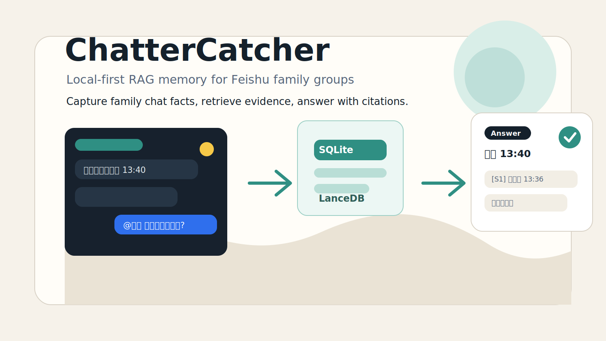
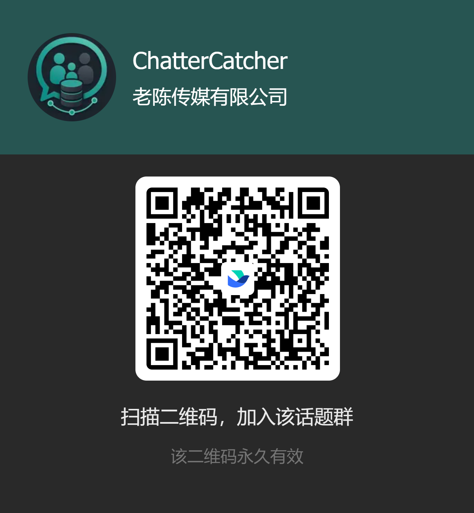
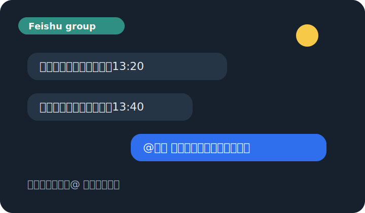
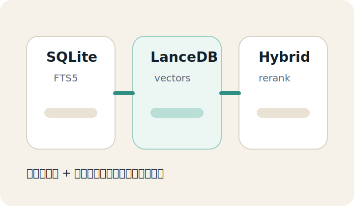
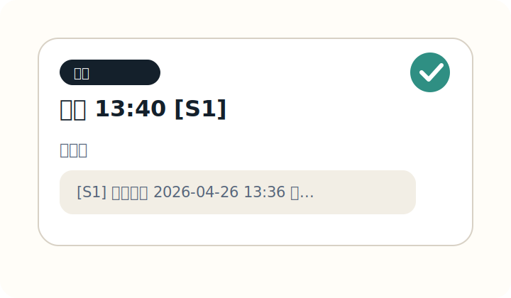
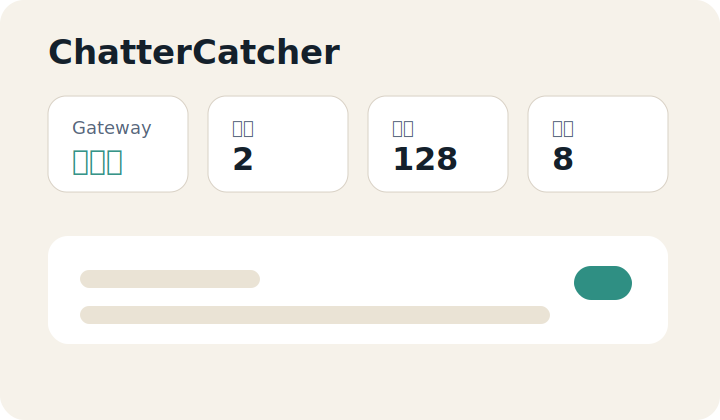
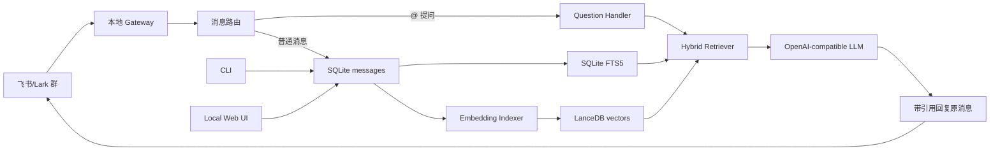

<p align="center">
  <a href="https://github.com/FlashingChen2024/chattercatcher">
    
  </a>
</p>

<h1 align="center">ChatterCatcher</h1>

<p align="center">
  
</p>

<p align="center">
  <strong>本地优先、证据驱动、面向飞书/Lark 家庭群的 RAG 记忆机器人。</strong>
</p>

<p align="center">
  静默保存家庭群里的重要消息和文件，被 @ 时用可追溯引用回答。
</p>

<p align="center">
  <a href="https://www.npmjs.com/package/chattercatcher"></a>
  <a href="https://github.com/FlashingChen2024/chattercatcher"></a>
  <a href="./LICENSE"></a>
</p>

<p align="center">
  
  
  
  
  
</p>

---

## 加入交流群

<table>
  <tr>
    <td width="280" valign="top">
      
    </td>
    <td valign="top">
      <h3>反馈、测试和共建</h3>
      <p>扫描左侧二维码加入 ChatterCatcher 飞书交流群。</p>
      <p>欢迎提交使用反馈、Bug、部署经验、飞书配置问题、RAG 行为建议和真实家庭群使用案例。</p>
      <p><strong>GitHub 仓库：</strong><a href="https://github.com/FlashingChen2024/chattercatcher">https://github.com/FlashingChen2024/chattercatcher</a></p>
    </td>
  </tr>
</table>

---

## 项目状态

ChatterCatcher 是一个早期 MVP。它已经具备飞书长连接接入、本地消息存储、SQLite FTS、LanceDB 向量检索、OpenAI-compatible LLM/Embedding、CLI、本地 Web UI 和带引用回答。

当前核心方向是：

- 让家庭群信息自然沉淀为本地知识库，而不是靠手动整理。
- 所有事实性回答必须先检索 RAG 证据，不能把大量历史聊天直接塞给 LLM。
- `@` 机器人的提问不进入知识库，避免污染检索结果。
- 回答必须能追溯到“谁在什么时候说了什么”。
- 新信息覆盖旧信息时保留历史证据，并优先使用明确、更新的证据。
- 默认本地部署，Web UI 默认只监听 `127.0.0.1`。

---

## 项目预览

<table>
  <tr>
    <td width="50%" valign="top">
      
      <br />
      <strong>飞书群消息捕获</strong>
      <br />
      普通群消息静默入库，保留发送人、群名、时间、原始平台元数据和文本内容。
    </td>
    <td width="50%" valign="top">
      
      <br />
      <strong>本地 RAG 检索</strong>
      <br />
      SQLite FTS 与 LanceDB 向量检索并存，回答前必须先召回证据。
    </td>
  </tr>
  <tr>
    <td width="50%" valign="top">
      
      <br />
      <strong>引用式回答</strong>
      <br />
      被 @ 后先即时反馈，再基于证据回复原消息，并输出可读来源。
    </td>
    <td width="50%" valign="top">
      
      <br />
      <strong>本地 Web UI</strong>
      <br />
      查看 Gateway 状态、最近消息、群聊、文件库、解析任务和本地操作入口。
    </td>
  </tr>
</table>

---

## 核心能力

| 模块 | 能力 |
| --- | --- |
| 飞书 Gateway | 官方长连接、`im.message.receive_v1` 事件、重复投递保护、附件下载入口 |
| 消息入库 | 普通文本消息写入 SQLite；`@` 提问直接回答并跳过入库 |
| RAG 检索 | SQLite FTS 关键词检索、LanceDB 向量检索、混合重排、证据来源保留 |
| 问答 | OpenAI-compatible chat completions、证据不足时说不知道、回答带引用 |
| 引用格式 | 展示“谁在什么时候说了什么”，避免暴露 `ou_` / `oc_` 等 opaque id |
| 文件知识源 | 支持 txt、md、json、csv、tsv、log、docx、pdf 导入和解析 |
| CLI | setup、settings、doctor、gateway、process、index、files、export、restore |
| Web UI | 本地状态看板、自动刷新、最近消息、群聊、文件库和解析任务 |
| 隐私 | 配置与密钥分离；导出不包含 API Key、App Secret 或 token |
| 数据管理 | 本地导出/恢复、按消息/文件/群删除本地知识库数据 |

---

## 架构概览



---

## 从零开始搭建

### 1. 环境要求

- Node.js 20 或更高
- npm 10 或更高
- 一个飞书/Lark 自建应用
- 一个 OpenAI-compatible LLM API Key
- 一个 OpenAI-compatible Embedding API Key，或复用 LLM API Key

### 2. 安装

```bash
npm install -g chattercatcher
```

检查 CLI：

```bash
chattercatcher --help
```

### 3. 创建飞书应用

1. 打开 [飞书应用创建入口](https://open.feishu.cn/page/launcher)，创建一个自建应用。
2. 在飞书开发者后台开通机器人能力。
3. 把机器人加入目标家庭群。
4. 在事件订阅里选择长连接模式。
5. 订阅 `im.message.receive_v1`。
6. 记录 App ID 和 App Secret。

### 4. 配置 ChatterCatcher

```bash
chattercatcher setup
```

`setup` 会写入：

| 配置项 | 说明 |
| --- | --- |
| 飞书 App ID | 普通配置 |
| 飞书 App Secret | 写入 `secrets.json` |
| LLM Base URL | OpenAI-compatible chat completions endpoint |
| LLM API Key | 写入 `secrets.json` |
| LLM Model | 用于答案生成 |
| Embedding Base URL | 可复用 LLM Base URL |
| Embedding API Key | 留空可复用 LLM API Key |
| Embedding Model | 用于 LanceDB 语义检索 |
| Web UI Host/Port | 默认 `127.0.0.1:3878` |

### 5. 检查配置

```bash
chattercatcher doctor --online
```

### 6. 启动 Gateway 和 Web UI

```bash
chattercatcher gateway start
```

默认 Web UI：

```text
http://127.0.0.1:3878
```

---

## 使用方式

普通群消息会静默进入知识库：

```text
编程课的时间改成了后天13:40
```

提问时在群里 @ 机器人：

```text
@小陈 最近一次编程课是什么时候
```

机器人会先即时反馈，再基于本地证据回答。提问本身不会入库。

期望回答类似：

```text
后天 13:40 [S1]。

引用：
[S1] 群成员在 2026-04-26 13:36 说：“编程课的时间改成了后天13:40”
```

---

## 常用命令

| 命令 | 说明 |
| --- | --- |
| `chattercatcher setup` | 交互式初始化配置 |
| `chattercatcher settings show` | 查看脱敏配置 |
| `chattercatcher doctor --online` | 检查本地配置、存储和在线连通性 |
| `chattercatcher gateway start` | 启动飞书长连接 Gateway 和本地 Web UI |
| `chattercatcher gateway status` | 查看 Gateway 状态 |
| `chattercatcher gateway stop` | 停止 Gateway |
| `chattercatcher process messages` | 立即处理消息索引任务 |
| `chattercatcher index rebuild` | 重建 LanceDB 向量索引 |
| `chattercatcher files add <path...>` | 导入本地文件知识源 |
| `chattercatcher files jobs` | 查看文件解析任务 |
| `chattercatcher export --out <file>` | 导出本地知识库数据，不含密钥 |
| `chattercatcher restore <file>` | 从导出文件恢复 |

---

## 本地数据目录

默认数据目录：

```text
~/.chattercatcher/
|-- config.json
|-- secrets.json
`-- data/
    |-- chattercatcher.db
    |-- files/
    |-- exports/
    `-- vector/
        `-- lancedb/
```

这些内容不应该提交到 GitHub：

```text
config/
data/
.env
node_modules/
dist/
```

---

## 隐私与安全

- 默认本地部署。
- 默认 Web UI 只监听 `127.0.0.1`。
- 聊天记录、文件内容、OCR 结果和语音转写都视为隐私数据。
- App Secret、API Key 和 token 与普通配置分开保存。
- 导出文件不包含密钥。
- 事实性回答必须基于检索证据。
- 检索不到证据时必须说不知道。

---

## 本地开发

```bash
npm install
npm run lint
npm run typecheck
npm test
npm run build
```

运行开发版 CLI：

```bash
npm run dev -- --help
```

---

## 常见问题

### `@` 机器人的问题会进知识库吗？

不会。`@` 提问是查询意图，不是家庭事实。ChatterCatcher 会直接回答并跳过入库，避免污染 RAG。

### 没有 embedding 能用吗？

可以保留 SQLite FTS 关键词检索，但语义检索需要配置 embedding。建议运行 `chattercatcher doctor --online` 确认维度和连通性。

### macOS 上提示 `Cannot find native binding` 怎么办？

这是 LanceDB 的 native optional dependency 没有被 npm 装完整，常见于 npm 全局安装时漏装可选依赖。先重装：

```bash
npm uninstall -g chattercatcher
npm install -g chattercatcher --include=optional
```

如果仍然失败，清理 npm cache 后再装：

```bash
npm cache clean --force
npm install -g chattercatcher --include=optional
```

`chattercatcher --version` 和 `chattercatcher --help` 从 `0.1.1` 起不会加载 LanceDB native binding；只有 `index`、`process messages`、配置了 embedding 的问答等向量检索路径才需要 LanceDB native 包。

### 为什么要用 RAG？

家庭聊天是长期知识库，不应该靠把全部历史消息塞进上下文。RAG 可以控制证据范围、保留来源、降低幻觉，并让回答可追溯。

### Web UI 可以暴露到公网吗？

默认不建议。ChatterCatcher 面向家庭隐私数据，默认只监听 `127.0.0.1`。

---

## License

This project is licensed under the [MIT License](./LICENSE).
