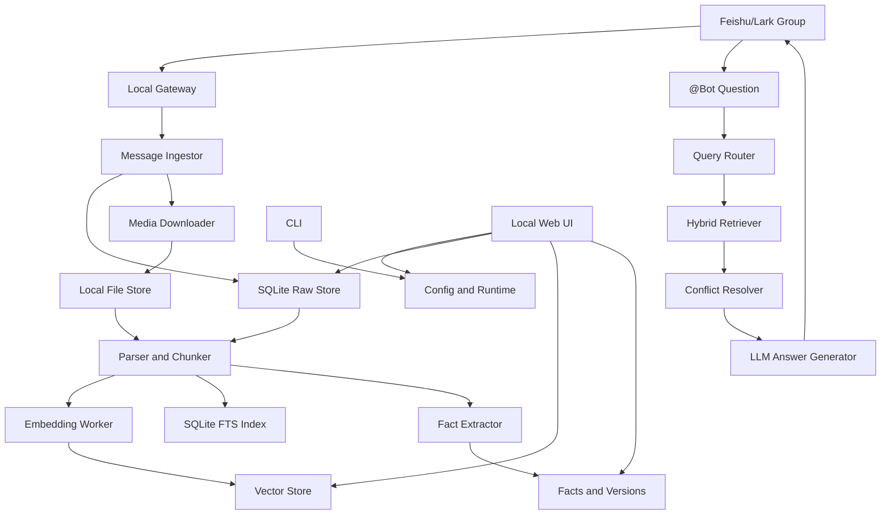

# Technical Architecture

## High-Level Architecture



## Runtime

- Node.js 20+
- TypeScript
- npm global package
- Local-first runtime

## Recommended Stack

### CLI

- `commander` for command structure.
- `@inquirer/prompts` for guided setup and settings.
- `pino` for logging.

### Gateway and API

- `fastify` for local HTTP API and Web UI backend.
- `@larksuiteoapi/node-sdk` for Feishu/Lark API and long connection support.

### Web UI

- React.
- Vite.
- TanStack Query.
- TanStack Router.
- Tailwind CSS.
- Radix UI or shadcn/ui.

### Storage

- SQLite for metadata, raw messages, jobs, settings, and facts.
- Drizzle ORM for schema and migrations.
- SQLite FTS5 for keyword retrieval.
- LanceDB or another local embedded vector store for embeddings.

### LLM and Embeddings

- OpenAI-compatible chat completions API.
- OpenAI-compatible embeddings API.
- Configurable base URL, API key, model names, and dimensions.
- `doctor` must validate provider compatibility.

### Parsers

- PDF: `pdf-parse` or `unpdf`.
- DOCX: `mammoth`.
- XLSX: `xlsx`.
- PPTX: unzip XML extraction first, dedicated parser later if needed.
- HTML/link content: `cheerio` plus readability extraction.
- OCR: configurable path, with Tesseract.js or model-based OCR.
- Audio: configurable OpenAI-compatible transcription first, local Whisper later.

## Local Data Layout

Default:

```text
~/.chattercatcher/
  config.json
  secrets.json
  data/
    chattercatcher.db
    files/
    thumbnails/
    transcripts/
    vector/
  logs/
  cache/
```

`config.json` stores non-sensitive configuration.

`secrets.json` stores sensitive values:

- Feishu App Secret.
- LLM API key.
- Embedding API key when separate.

## Core Data Model

### chats

```text
id
platform
platform_chat_id
name
created_at
updated_at
```

### messages

```text
id
platform
platform_message_id
chat_id
sender_id
sender_name
message_type
text
raw_payload_json
sent_at
received_at
created_at
```

### files

```text
id
message_id
platform_file_key
file_name
mime_type
local_path
sha256
size_bytes
parse_status
created_at
updated_at
```

### chunks

```text
id
source_type
source_id
chunk_index
text
metadata_json
created_at
```

### embeddings

```text
id
chunk_id
provider
model
dimension
vector_ref
created_at
```

### facts

```text
id
subject
predicate
value
confidence
status
source_chunk_id
supersedes_fact_id
valid_from
created_at
```

### qa_logs

```text
id
chat_id
question_message_id
question
answer
citations_json
retrieval_debug_json
created_at
```

### jobs

```text
id
type
status
payload_json
attempts
last_error
created_at
updated_at
```

## Retrieval Design

Use hybrid retrieval:

1. Query rewrite and intent classification.
2. Vector search over chunks.
3. Keyword search through SQLite FTS5.
4. Metadata filters by chat, time, sender, and source type.
5. Recency-aware reranking.
6. Fact-aware conflict resolution.
7. LLM answer generation with citations.

The answer generator must receive compact evidence blocks, not raw unlimited chat history.

## Conflict Resolution

Conflict handling must not be plain "latest wins".

Use the following checks:

- Same or highly similar subject.
- Same predicate.
- Newer source timestamp.
- Update language such as:
  - 改到
  - 更新为
  - 最终定
  - 以这个为准
  - 不是之前那个
- Sufficient confidence that the message states a fact, not a suggestion.

Statuses:

- `active`: current best-known fact.
- `superseded`: old fact replaced by a newer confirmed fact.
- `ambiguous`: relevant evidence that should not overwrite active facts.

## Feishu/Lark Gateway

MVP should follow the local gateway pattern:

- The user creates a Feishu/Lark self-built app.
- The user enables bot capability.
- The user configures App ID and App Secret.
- The user enables long connection event subscription.
- ChatterCatcher opens the long connection from the local machine.
- Incoming message events are normalized into internal message objects.
- Replies are sent through the Feishu/Lark bot API.

Required event:

```text
im.message.receive_v1
```

Required behavior:

- Groups require mention to answer by default.
- All messages are still captured unless disabled by settings.
- Direct messages can be supported later.

## Configuration

Configuration must be editable from:

- `chattercatcher setup`
- `chattercatcher settings`
- local Web UI

Important fields:

```json
{
  "feishu": {
    "domain": "feishu",
    "appId": "",
    "groupPolicy": "open",
    "requireMention": true
  },
  "llm": {
    "baseUrl": "",
    "model": ""
  },
  "embedding": {
    "baseUrl": "",
    "model": "",
    "dimension": null
  },
  "storage": {
    "dataDir": "~/.chattercatcher/data"
  },
  "web": {
    "host": "127.0.0.1",
    "port": 3878
  }
}
```

Secrets must not be stored in this file.

## Operational Commands

```bash
chattercatcher setup
chattercatcher settings
chattercatcher doctor
chattercatcher gateway start
chattercatcher gateway status
chattercatcher logs --follow
chattercatcher index rebuild
chattercatcher web start
```

## Testing Strategy

Testing should be layered:

- Unit tests for pure logic:
  - config validation
  - message normalization
  - chunking
  - conflict resolution
  - citation formatting
- Integration tests for:
  - SQLite migrations
  - vector store adapter
  - indexing jobs
  - mocked Feishu events
  - mocked OpenAI-compatible providers
- UI tests for:
  - settings page
  - history page
  - file library
  - QA logs

Manual smoke tests should cover:

- Fresh setup.
- Gateway start.
- Message capture.
- Mention-triggered answer.
- Reindex.
- Web UI inspection.

